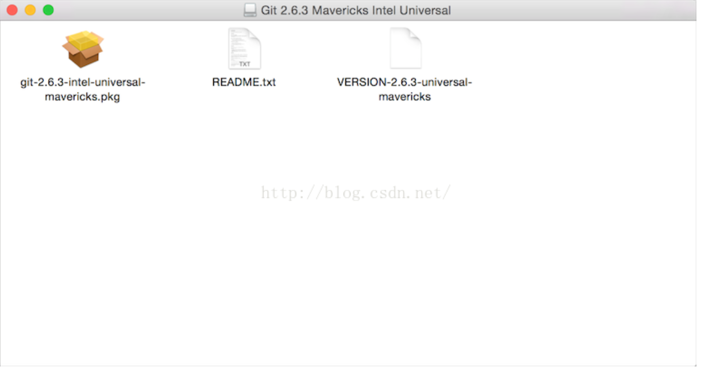
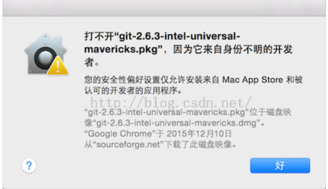
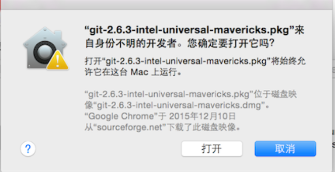

最近入职一家新公司,新公司给配置的电脑为mac,因为一直都是用window 所以对mac的操作方式不是很熟悉,今天就来总结一下mac上如何安装git工具.
<!-- more -->
mac下git安装和使用
1、下载git客户端，下载地址为：https://git-scm.com/download/mac
2、打开安装包，可以看到此时的界面为：




 
我们需要把.pkg的安装包安装到系统当中。我双击了安装包之后，结果无法安装成功。界面为：



这里是一个坑，虽然是很简单的问题的，但是对于新手而言有时候还是头疼的。后来，在网上终于找到原因，由于这个需要权限，所以直接点击安装是无法成功的。方式是按住control键之后，再点击pkg文件。这个时候会弹出安装程序的界面。如



所示。然后选择打开，就可以完成安装了。
 
3、创建ssh

     a、检查SSH key
          打开终端，运行
     ```
          cd ~/.ssh
     ```
     如果路径下无文件，直接跳过下一步，如果有代表有ssh key，需进行第二步进行备份

     b、备份已有的key，（如果有的话）
     ```
          mkdir key_backup

          mv id_rsa* key_backup
     ```
     c、.生成SSH key

     ```
     $ ssh-keygen -t rsa -C jonezhang86@gmail.com（注册的main邮箱）

     Generating public/private rsa key pair.

     Enter file in which to save the key (/Users/jiangbo/.ssh/id_rsa):

     Enter passphrase (empty for no passphrase):

     Enter same passphrase again:

     Your identification has been saved in yes.

     Your public key has been saved in id_rsa.pub.

     The key fingerprint is:

     fb:c4:b0:e0:47:fd:be:e0:fb:ea:73:ef:a8:29:d5:22 jonezhang86@gmail.com

     The key's randomart image is:

     +--[ RSA 2048]----+

     |                 |

     |                 |

     |                 |

     |         .       |

     |      . S ..     |

     |     . oE=o..    |

     |      . +o+..    |

     |       ..+.+..   |

     |         oOB=+o  |

     +-----------------+

     ```
4）将SSH key添加到github/gitlab上

a、打开终端，输入open ~/.ssh，查看id_rsa.pub这个文件并打开拷贝key值

b、打开github/gitlab官网，登录成功后，点击账户-SSH公钥，输入a步拷贝的值，点击提交

 

5）建立本地仓库并初始化

1、命令行打开本次仓库的文件夹目录或者直接创建
```
cd !/（目录)
```
2、仓库初始化
```
git init
```
3、将项目克隆到本地仓库
```
git clone URL（项目的SSH地址）
```
4、更新远程更新到本地：

先打开本地仓库的目录，要是程序文件夹的目录

然后输入更新代码命令，如下所示：
```
git pull 
```
5、提交代码
```
git add .
git commit -m “描述”
git push origin master
```
常见问题记录FAQ

1.git pull代码的时候报如下错：
```
error: Your local changes to the following files would be overwritten by merge:

Please, commit your changes or stash them before you can merge.
```
这表示更新下来的内容和本地修改的内容有冲突，先提交你的改变或者先将本地修改暂时存储起来

解决方法：先将本地内容存储起来，运行命令：git stach

再git pull 即可

 

2、git pull的时候报如下错：
```
fatal: No remote repository specified. Please, specify either a URL or a

remote name from which new revisions should be fetched.
```
问题：打开的路径不对

解决方法：打开本次仓库的正确路径，在更新代码
