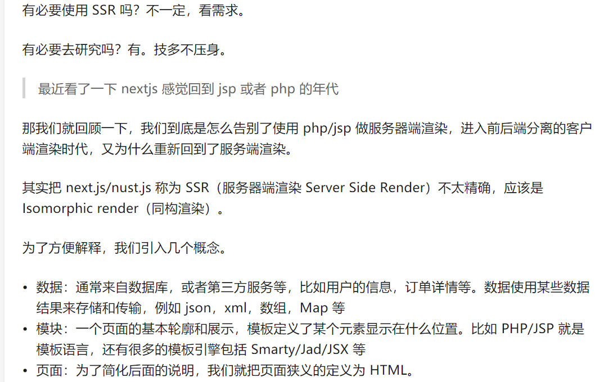

今天我来大家来了解一下前端新框架-next.js 
以及我们为什么要用next.js，在怎样的实际业务场景下用next.js。
<!-- more -->
# next.js是什么？
  Next.js是一个基于React实现的服务端渲染框架。
  ## 服务端渲染是什么？客户端渲染是什么
  
  
  
  如上图所讲,next.js就是一个同构渲染的框架.
  next.js很适合面向C端的项目以及展示型的网页 - 比如公司官网网页,以及要处理SEO的问题,就可以选用next.js这门技术。
# next.js项目的目录结构
  pages下面生成路由需要的组件
## static
  放置静态资源的文件
## components
  放置公用组件
## lib
  放置公用函数
## .next
  next.js生成的目录.
## next.config.js
  next.js的配置文件

# next.js 如何进行页面中的跳转
  link 组件
  router - router.push()

# 动态路由
  通过router.query来进行取值
  ```
  import { withRouter } from 'next/router'
  ({ router }) => <span>{router.query}</span>
  ```

# 路由映射
```
<Link as={value} />
Router.push()的第二个参数
```
刷新就会出问题


# 路由变化的钩子


# nextjs获取数据的方式

在页面中获取数据
getInitailProps
在app中获取数据

 