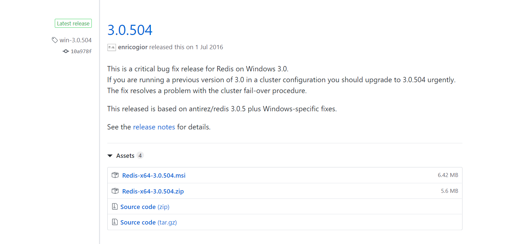
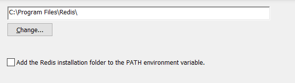
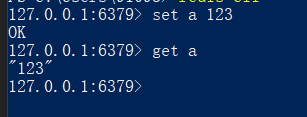
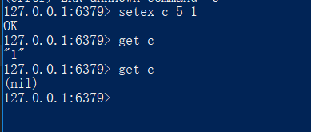
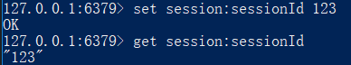
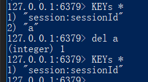

全栈工程师的更近一步,数据库篇.
带大家来了解redis的安装和使用
<!-- more -->
Redis是一个使用ANSI C编写的开源、支持网络、基于内存、可选持久性的键值对存储数据库。
它和mysql 不一样,它不用创建表，并对表select , 它基于key和value的形式.并且很简便,API很好掌握.

所以来讲下关于redis的安装

** redis的window安装
 虽然redis的版本已经出到 5 以上的版本,但是在window上只能找到 3 版本的安装
 而且下载地址不是很好找
 https://github.com/MicrosoftArchive/redis/releases 这个就是redis window 上的下载地址
 

下载这个3.0.504,这也是window上最稳定的版本.

下载下来后安装就行了,但是有一点要注意,要把你的redis安装到全局path中去,如果你不安装到全局path中,你必须切到安装目录,才能启动redis。
而且把redis把其他框架连接,比如next和react是连接不上的.

记住要把这个对勾填上,你才能把redis安装到全局路径.

其他的安装过程中不需要注意,点next就可以了.

然后你在的window.powershell中 打入redis-cli 如果有内容弹出来,就证明你安装成功,并且写到全局路径.

关于redis的几个关键api,我给大家介绍一下

set {key} {value} - 给key赋值
get {key}  - 取到key的值

setex - 如上图 给c赋值为1 并且有5s的持续时间 过5s后 c的值就会消除

非常适合于登陆session这个业务,直接可以在数据库这边操作.

如果在前端这边操作,还要做轮询,非常麻烦

set {key}:{key} {value} 这个是设置在session字段下的sessionId的值,就相当于mysql的表一样.

KEYs * - 取到所有key的值
del {key} - 删除key的值

