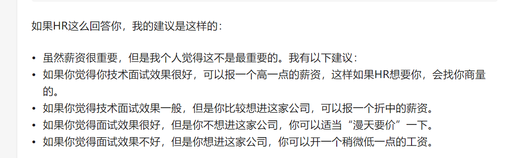

最近一直在找工作,面的企业有很多家了,也见识过一些套路了,今天我们就来说一下,面试中最关系自己自身利益的环节,如何和hr谈薪资.
<!-- more -->
    前语: 摆正你的心态,在面试过程中尽量表现出自信的神态,就像一个谈判家一样,谈吐之前睥睨天下 。

一般去一家企业的话都会经历3面,技术面 - 总监面 - hr面

### 技术面 - 

其中技术面的话主要考察你的技术;假如你是程序员的话,我建议你离职的那段时间一定要复习下市面上常见的面试题目,面试就跟背题库一样,面试官提出问题,你来回复.

### 总监面 - 

总监面的话,主要是总监来定人,总监一般不会考察技术上的问题,他会考察你的个人经历和项目经历 还有考察你这个人的综合能力,看你的气质如何,所以程序员面试的时候一定要在总监面的时候表现的自信一点,胸有成竹,表现的有气场,毕竟面试有时候完全就是一个看眼缘的过程。

### hr面 - 

最后一个点来了,hr面 一般定人,是总监来定人,你能到第三面的话，基本上是ok的,证明他们还是想要你的,
这时候他们就派hr来和你进行谈薪资了，毕竟谈薪资是一个很重要的过程.毕竟出来打工都是为了钱的,而且hr大都是是经验十足,像你一个老实巴交的程序员,和老狐狸进行谈判,所以市面上的求职者大部分会吃亏,这时候就需要点技巧了。

招聘就像销售一样, 其中的一些话术你一定要知道的. 你就可以反话术。

### 第一市场价值 - 根据市场行情来定,再结合自己的能力,先确定一个你的期望薪资.

你去面试之前肯定要了解一下,在招聘软件上面看一下,你这个岗位的平均薪资在市面上的. 

比如 1-3年工作经验 10K-15K
3-5年工作经验 15K-20K

假如你有2年经验,你去一家企业面试,你期望有20K的薪资,有点不合理的,因为市面上的价格就在这里,就算你的能力很强,你觉得自己就值20K,但是招聘方的预算就在这里,而且用人单位有很多可选项,他们不会给你大于15K的期望,你自己的期望薪资不能漫天要价,要根据实际市场行情来.

### 第二 -  根据实际面试情况, 还有招聘方JD上标注的薪资范围 , 以你的第一步的期望薪资来进行调整

一般招聘方都有个招聘区间,比如10k - 20k ,如果你是职场小白,第一眼一看,哇,20K 好高啊,其实像这种一般都是按照10K起步的预算开始算的,20K的话只是唬人眼球.

第二步你就要根据 招聘方的薪资范围和实际面试期望来更改你心目中的期望薪资.

### 第三步 - 这时候就要开始和hr谈,所以一些话术和谈判技巧就很重要.

# 话术篇 - 

## HR问到期望薪资时：

不要直接报价！！！正确的回答方式应该反套路HR，说白了就是打心理战。如何反套路？就是反问HR，比如“贵公司对于这个岗位能给出的薪资范畴是多少？”有助于帮助我们弄清岗位预算，可以对比自己的期望值，给出一个适合的薪资。

## 报价范围：

反问薪资结构后再报价，报价先报一个范围区间而不是直接上具体数字，然后根据薪资结构调整你的报价范围，这样就算遇到HR压价我们也还有可谈的余地。

## HR问到上家公司的薪资时：

有些小伙伴可能会想我的上家公司薪资就很低，该怎么回答好呢？告诉对方平均月收入即可，就是你年收入的各种补贴、奖金、公积金全部加上，然后再除以12。对方会自己脑补成是你的税前月薪，这样一来二去总能相差个几千块吧？同时你也没骗人。

## 跳槽薪资增长30%？

跳槽薪水在原有基础上增长30%上下属于正常并且保守的估计。其实决定薪资的主要因素为“市场价格，谈判技巧与岗位预算”三部分，而不是上一家给的薪水数额以及难以评估的能力，但也是因为能力在短时间内难以评估，所以才会有人提出30%一刀切的方式，其实如果能力出众的还是可以通过谈判技巧再往上涨涨的，没有固定值。

## 多面试几家公司：

多面试几家公司,可以让你了解行业工资水平,毕竟同一个岗位,不同工资可能差别会很大,俗话说的好，别在一棵树上吊死嘛。面试谈薪是一场与人交际的谈判，需要多磨练，多尝试与总结。如果一开始心里还是没底又紧张的话，可以先面试几家一般点的公司，当练手并且总结经验，把心仪的公司放在最后。

## 尽量别离职状态找工作：

一般与HR谈薪过程中，既要展示自己对求职岗位有很大的兴趣，但又不能暴露自己着急找工作的心态，尤其是手上没offer，而且还是离职的状态下，这样会让自己处于被动方。

## 面试登记表有些信息可以暂不填：

比如期望薪资，再或者，现在工作证明人以及联系方式，填了可能会使你谈薪资陷入被动方，如果是必要信息可以告知对方入职后再补。

## 个人职业发展：
对于工作年限不长的知友，个人建议，如果两份工作月薪相差不算太大的话，优先选择更有利于自己个人发展的工作机会，这条尤其适用于职场萌新。

提升解决问题的能力是本质，面试时的谈薪技巧只为锦上添花。

    结语: 像这种谈薪技巧只是辅助,真正决定你的薪资水平的还是你的各方面综合能力和技术水平。
