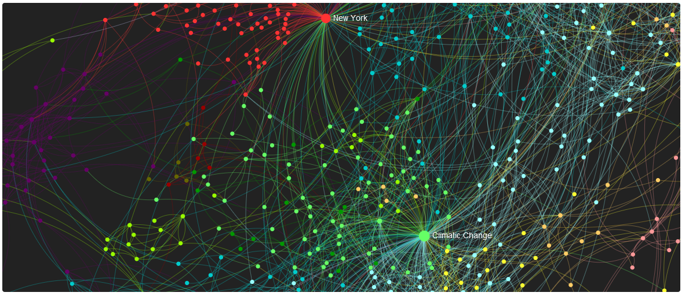
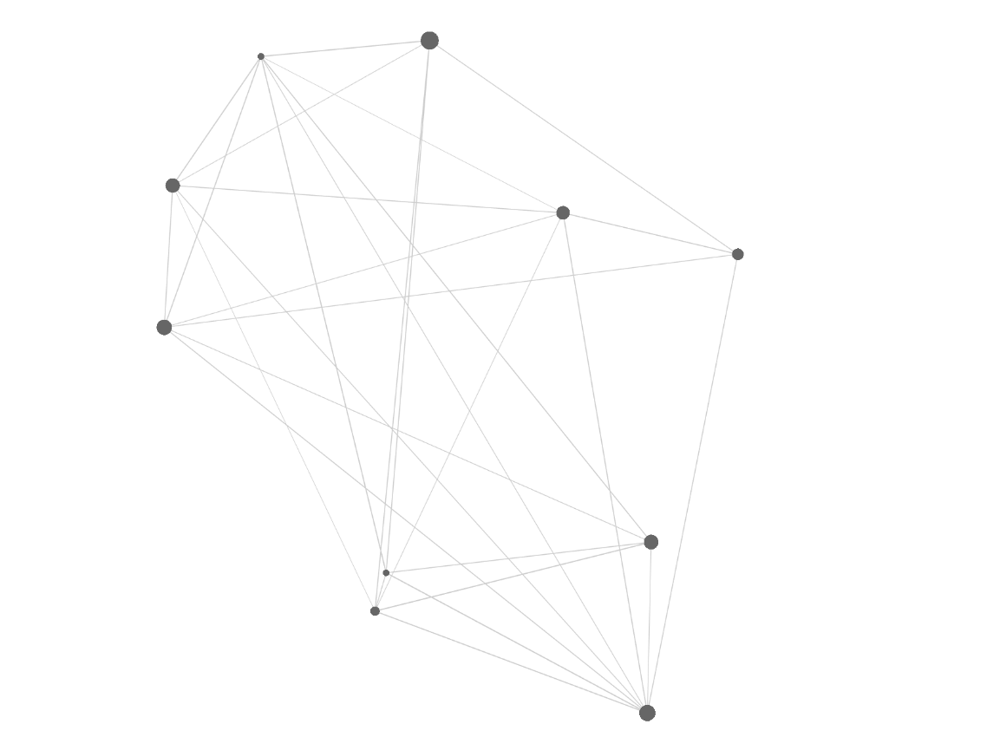

最近由于业务需求,需要用到sigma.js来做那个页面. 今天我就来带大家了解一下sigma.js
<!-- more -->
sigma 是一个专门的用来展示图表的js库.它被设计的你能用它来定制化和用它来开发高度可交互化的web应用来展示图表工具.

综述

任何sigma的实例都是基于图标层和控制器,图标层是sigma的一部分用来帮助操作数据的,控制层是提供一些有用的方法来交互渲染过程，数据和你的应用的.

开始
确保你的电脑上有git和node,并从网上clone下开源库

```
$ git clone https://github.com/jacomyal/sigma.js.git
$ cd sigma.js
$ npm install
```
然后
```
yarn build或者npm run build
```
打包出build文件夹,然后就可以在你的build文件夹下面就可以看见sigma.min.js 和 sigma.require.js

这时候你就可以在你的html中引用sigma.min.js这个文件了.

然后再copy一下官网上的html代码
```
<!DOCTYPE html>
<html>
<head>
  <title>Basic sigma.js example</title>
  <style type="text/css">
    body {
      margin: 0;
    }
    #container {
      position: absolute;
      width: 100%;
      height: 100%;
    }
  </style>
</head>
<body>
  <div id="container"></div>
  <script src="./sigma.min.js"></script>
  <script>
    // Let's first initialize sigma:
    var s = new sigma('container');

    // Then, let's add some data to display:
    s.graph.addNode({
      // Main attributes:
      id: 'n0',
      label: 'Hello',
      // Display attributes:
      x: 0,
      y: 0,
      size: 1,
      color: '#f00'
    }).addNode({
      // Main attributes:
      id: 'n1',
      label: 'World !',
      // Display attributes:
      x: 1,
      y: 1,
      size: 1,
      color: '#00f'
    }).addEdge({
      id: 'e0',
      // Reference extremities:
      source: 'n0',
      target: 'n1'
    });

    // Finally, let's ask our sigma instance to refresh:
    s.refresh();
  </script>
</body>
</html>
```
这时候你就可以看到你的第一个demo图出来了,接下来就让我们熟悉一下它的API的使用吧.
```
note:
clone下来的文件夹中有一个example文件夹,你可以在example文件夹中看各个sigma.js实现的效果,
然后你自己再根据那个文档的代码 , 来决定你要看什么API。
```
比如,产品给了我一个需要可拖动连线的节点,我就在example里面去找一下,看哪一个html满足我的需求,我找到了满足我需求的文档.所以我决定看Graph 的API.

Graph API

下面为Graph API的翻译

sigma.classes.graph 实现了sigma的图表层 .

公共的方法:

节点 ： array

这个方法是用来检索图层的节点，如果

边缘： array

这个方法是用来检索图表的边缘层.

经过我的一番探索,sigma可drag的demo终于被我写出来了,如下图所示。 



实现这个demo的思路就是 

第一步 - 创建node,你需要创建几个节点.

第二点 - 创建edge(线),把这个节点用线给连接起来.

具体如何操作,请看下面代码
```
var i,
    s,
    N = 10  ,
    E = 50,
    g = {
      nodes: [],
      edges: []
    };

// Generate a random graph:
for (i = 0; i < N; i++)
  g.nodes.push({
    id: 'n' + i,
    label: 'Node ' + i,
    x: Math.random(),
    y: Math.random(),
    size: Math.random(),
    color: '#666'
  });

for (i = 0; i < E; i++)
  g.edges.push({
    id: 'e' + i,
    source: 'n' + (Math.random() * N | 0),
    target: 'n' + (Math.random() * N | 0),
    size: Math.random(),
    color: '#ccc'
  });
// sigma.renderers.def = sigma.renderers.canvas
// Instantiate sigma:
s = new sigma({
  graph: g,
  container: 'graph-container'
});
```
节点就是一个数组,线也是一个数组,里面的对象来描述各个节点和线的信息.

